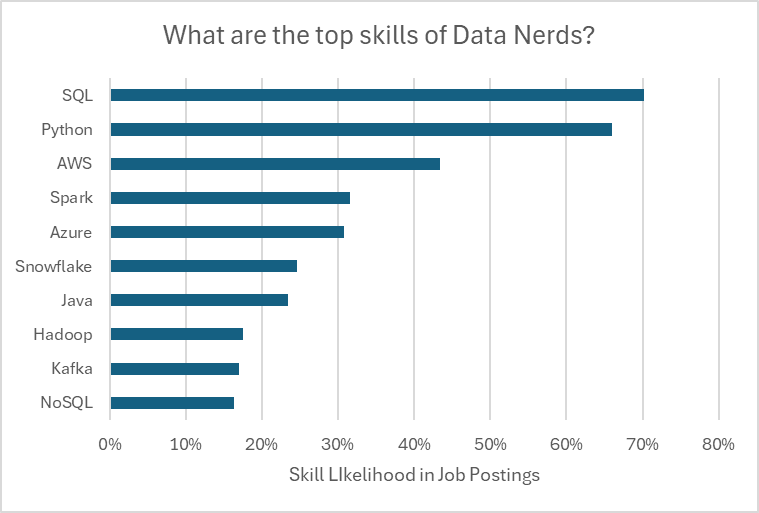

# MY Excel Project on Data Related Job Analytics

This project serves as a guide for freshers like me to understand the essential skills, salary expectations, and job opportunities in the data domain using Excel, one of the most powerful and industry-friendly tools.

## Salary Dashboard
This Data Jobs Salary Dashboard was designed to help job seekers explore salary trends for their desired roles and ensure they receive fair compensation.  
[For a detailed report on how this analysis was conducted, check out this link](Project_1-Dashboard)  

## Salary Analysis  
As a job seeker, I’ve always been surprised by the lack of data on the most optimal jobs and in-demand skills in the data science market. Driven by curiosity, I set out to analyze the key skills top employers seek and how they impact salary potential.  
[For a detailed report on how this analysis was conducted, check out this link](Project_2-Analysis)  

