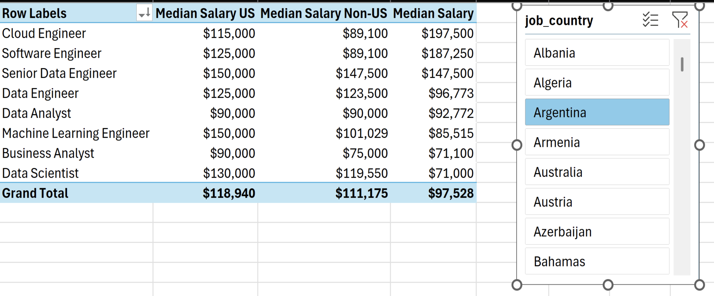

# My Excel Project on Data Job Market Analytics 🛠️

This project serves as a guide for freshers like me to understand the essential skills, salary expectations, and job opportunities in the data domain using Excel, one of the most powerful and industry-friendly tools.

## Salary Dashboard 💸
This Data Jobs Salary Dashboard was designed to help job seekers explore salary trends for their desired roles and ensure they receive fair compensation.  
[For a detailed report on how this analysis was conducted. Click here 👈](Project_1-Dashboard)  

## Salary Analysis 🎢
As a job seeker, I’ve always been surprised by the lack of data on the most optimal jobs and in-demand skills in the data science market. Driven by curiosity, I set out to analyze the key skills top employers seek and how they impact salary potential.  

[For a detailed report on how this analysis was conducted, Click here 👈](Project_2-Analysis)    

## Does having more skills correlate with better pay? 🤔

  

## If your country is outside the U.S., what is the median salary for different data-related roles?🤔 

 

## What are the top skills to learn if you're pursuing a data-related role? 🤔

  

## What is the median salary and likelihood of job opportunities for the top 10 in-demand skills in the data industry?🤔

